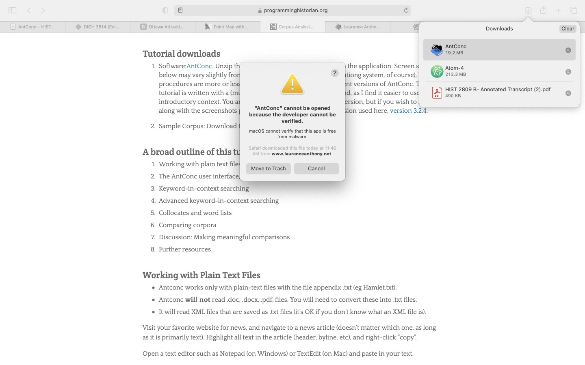
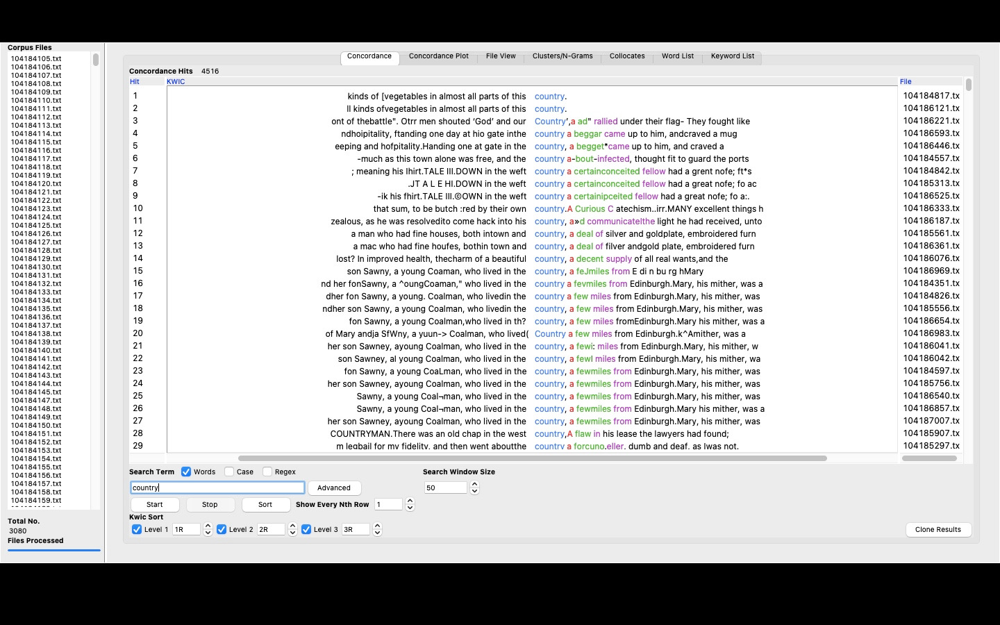
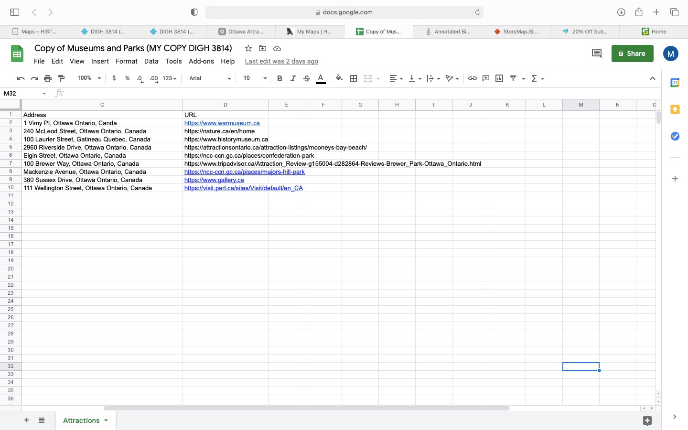

# DIGH 3814: Week 3 Coursework
## AntConc
1. As instructed in the tutorial by Heather Froelich, I installed the AntConc software onto my Mac.
2. Initially, I ran into a problem when trying to open the downloaded software as it looked like my Mac did not trust the software.

3. Eventually, I was able to change my Mac settings to open the software.
4. Once the software was open, I followed instructions by going to 'File' -> 'Open Dir'.
5. I selected the corpus of historical documents prepared in this week's AntConc tutorial.
6. The texts opened up in the corpus files column.

7. I played around with the 'Search Term' bar to locate different words.
8. After playing around with AntConc, I read through the bit about AntConc from the Data-Sitters club which I found helpful when trying to understand what the purpose of AntConc actually is.
9. Note: I liked that when the Data-Sitters club noticed that the term "little" had a high frequency, they also recognized that the term "a little" was mixed in their quite often as well. This helped me understand how AntConc can be used to locate words similar to each other.

## Storymaps.js
1. I followed instructions by logging into the Storymap website and then setting my base map (I chose 'Stamen Maps: Toner Background').
2. I then created my storymap. I chose to focus on American draft dodgers avoiding the Vietnam War draft because that is what was focused on in HIST 2809, the Historian's Craft, and I enjoyed learning about that material.
3. Here is my storymap: <iframe src="https://uploads.knightlab.com/storymapjs/b90ada26b6aa576fdf2fddcdd324579a/digh-3814/index.html" frameborder="0" width="100%" height="800"></iframe>

## Point Map With Google Storymaps
1. I downloaded the Google sheet and manipulated the data to input Ottawa museums, parks and other attractions.

2. I found it difficult to choose which Ottawa attractions to include because the city has so much to offer.
3. I changed the 'Museum' icon to a picture of the Canadian Museum of History (despite the fact that it is a Gatineau attraction) because I though it was fitting for a history class.
4. I changed the 'Park' icon to a picture of Major Hill Park because I think it represents the beauty of Ottawa.
5. I changed the 'Art Gallery' icon to a picture of the National Art Gallery of Canada as it was the only art gallery I included in my map.
6. I changed the 'Attraction' icon to a picture of Parliament Hill because it is one of Ottawa's most significant attractions.
7. Here is my map: <iframe src="https://www.google.com/maps/d/u/0/embed?mid=1VR3RvdKCCUaFTQoxdOcO73op04W7SEmX" width="640" height="480"></iframe>
